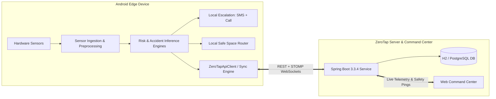
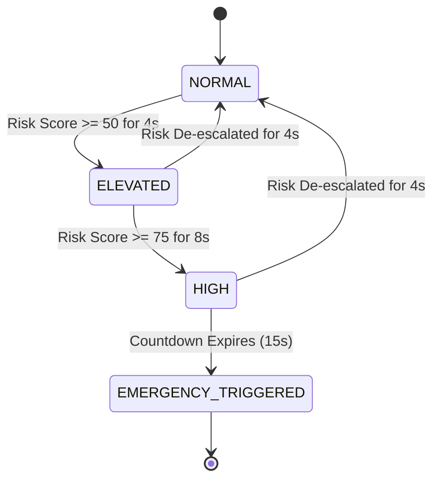
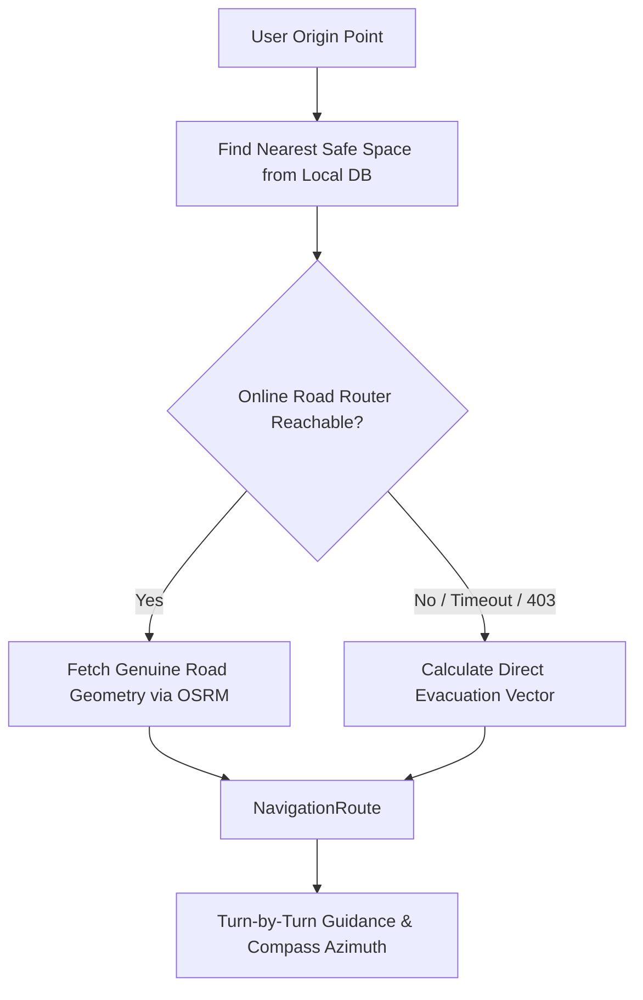
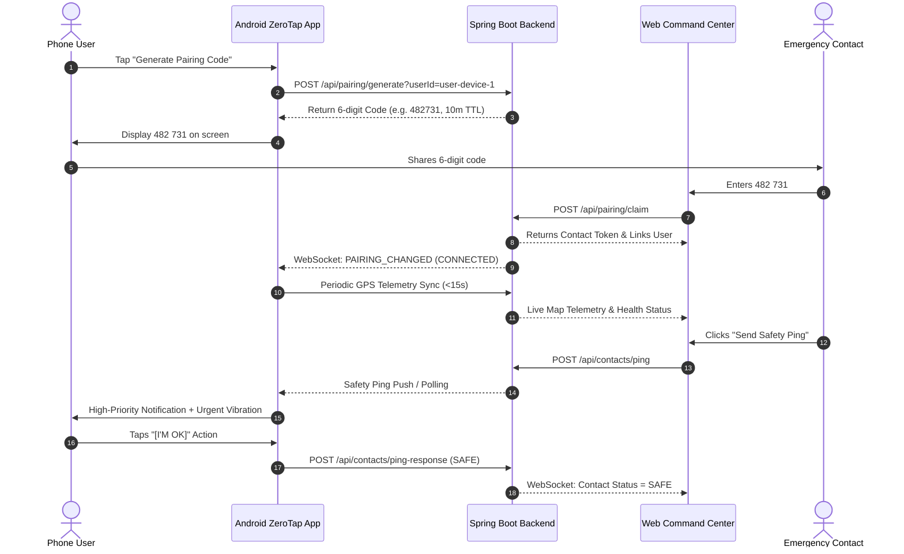

# ZeroTap System Architecture

This document provides a comprehensive technical breakdown of the **ZeroTap** personal safety platform, detailing the edge sensor pipelines, machine learning abstractions, emergency response orchestration, backend telemetry, and web command center integration.

---

## 1. System Topology

ZeroTap operates as a hybrid edge-first distributed system consisting of two primary tiers:

---

## 2. Edge Sensor Pipelines & Ingestion

### 2.1 Sensor Frequency and Ring Buffer Ingestion
The Android application relies on `ProtectionForegroundService` as its central coordinator:
* **Accelerometer & Gyroscope**: Ingested via `MotionDataSource` (SensorManager at `SENSOR_DELAY_GAME` ~50 Hz). Extracted into rolling 1-second feature windows.
* **Fused GPS Location**: Ingested via `LocationDataSource` using Google Play Services `FusedLocationProviderClient` with balanced power accuracy, updated every 5 seconds (2 seconds in high risk).
* **Microphone Acoustic Metadata**: Captured via `AudioDataSource` using `AudioRecord` at 16,000 Hz, 16-bit mono PCM. **Raw PCM audio is never saved to disk or transmitted.** Only decibel levels, zero-crossing rates, and spectral features are retained.
* **Evidence Ring Buffer**: An in-memory circular buffer preserving:
  - 600 motion samples (12 seconds)
  - 12 location samples (60 seconds)
  - 120 acoustic metadata records (120 seconds)

### 2.2 Acoustic Baseline Tracking (`AudioBaselineTracker`)
To prevent false alarms in noisy metropolitan settings (e.g., traffic horns, crowded buses, construction), ZeroTap discards static decibel thresholds:
$$\Delta dB = dB_{\text{current}} - dB_{\text{baseline}}$$
* Dynamically computes ambient noise baselines using exponential moving averages.
* Classifies acoustic states into `QUIET`, `NORMAL_AMBIENT`, `ELEVATED`, and `POTENTIAL_DISTRESS`.
* Elevates risk score only when sustained vocal distress or sudden acoustic anomalies deviate significantly from the local baseline.

---

## 3. Risk Prediction & Escalation State Machine

### 3.1 1-Second Evaluation Cycle
Every second, `ProtectionForegroundService` evaluates the current `UnifiedSensorContext`:
1. **Quiescence Check**: If the phone is completely stationary and ambient audio is quiet with normal risk, evaluation is bypassed to conserve battery.
2. **Feature Extraction**: Computes peak acceleration, rotational jerk, freefall duration, and acoustic variance.
3. **Risk Scoring**: Evaluated by `DevelopmentRiskPredictionEngine` on a normalized scale (0–100):
   - **0–24**: `NORMAL` (safe baseline)
   - **25–49**: `ELEVATED` (elevated awareness)
   - **50–74**: `HIGH` (danger suspected, countdown pre-armed)
   - **75–100**: `INCIDENT` / `EMERGENCY_TRIGGERED`
4. **Temporal Persistence**: `TemporalRiskTracker` requires high-risk signals to persist for $\ge 8\text{s}$ before triggering the emergency countdown, preventing false triggers from transient drops.

### 3.2 Vehicle Accident State Machine
An independent state machine tracks vehicle impact kinematics:
1. **Impact Detection**: Peak acceleration drop $> 24\text{ m/s}^2$ with high jerk.
2. **Verification**: Detects post-impact stillness ($\le 0.4\text{ m/s}^2$ deviation from gravity) and GPS velocity collapse.
3. **Grace Countdown**: Vibrates, speaks an audible confirmation prompt, and displays a 15-second cancellation dialog.
4. **Escalation**: If unacknowledged, triggers immediate SMS dispatch and phone call to the primary emergency contact with exact coordinates.

---

## 4. Safe Space Navigation & Evacuation Router

ZeroTap includes an offline-first safe space discovery and routing engine:

* **Local Database**: Embedded database (`safe_spaces_tamilnadu.json` and Room database) containing police stations, hospitals, 24/7 pharmacies, and fire stations.
* **Dual Routing Engine**:
  - **Online**: Queries OSRM road network with custom browser headers to generate full turn-by-turn road geometries.
  - **Offline Evacuation Fallback (`createDirectEvacuationRoute`)**: Computes direct Haversine distance, forward azimuth bearing ($0^\circ-360^\circ$), and 10 interpolated trajectory waypoints. Guarantees that guidance is available even if all networks fail.

---

## 5. Web Command Center & 1:1 Emergency Contact Pairing

### 5.1 Host Discovery & Multi-Network Resilience
`ZeroTapApiClient` automatically attempts multiple candidate endpoints:
1. `http://127.0.0.1:8080` (active when connected via USB reverse tethering `adb reverse tcp:8080 tcp:8080`)
2. `http://172.16.45.4:8080` (local Wi-Fi LAN address)
3. `http://10.0.2.2:8080` (Android emulator loopback)
4. **Offline Fallback**: If the server is unreachable, the app generates a standalone 6-digit code locally. The server's `claimPairingCode` service accepts valid 6-digit codes and links them to the primary device.

---

## 6. Vehicle License Plate Vision Pipeline

Located in `vehicle_plate_ai/`:
1. **Detection**: Roboflow bounding box model detects vehicle license plates in captured evidence frames.
2. **Preprocessing**: Perspective rectification, adaptive histogram equalization (CLAHE), and binarization.
3. **Recognition**: PaddleOCR extracts raw alphanumeric characters.
4. **Validation**: Validates Indian state codes (e.g., `TN`, `KA`, `DL`, `MH`) and standard license formats (`^[A-Z]{2}[0-9]{1,2}[A-Z]{1,3}[0-9]{4}$`).

---

## 7. Security, Privacy, and Data Governance

* **Edge Isolation**: Zero sensor data leaves the device unless an emergency is triggered or server mode is enabled.
* **Token Expiration**: Pairing codes expire after 10 minutes and can only be claimed once.
* **Single Primary Contact**: For hackathon security, strict 1:1 user-to-contact isolation is enforced at the database level.
