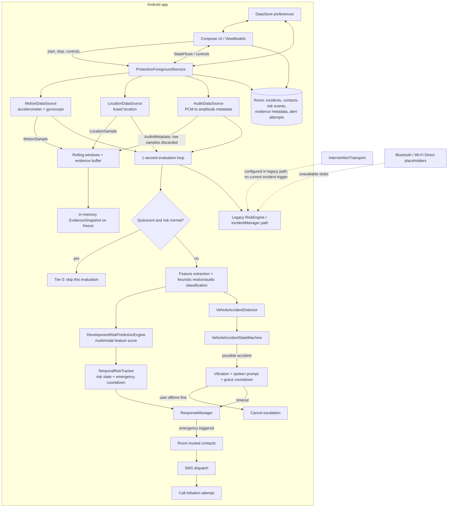

# ZeroTap

ZeroTap is an Android personal-safety prototype. While protection is running, a foreground service collects motion, location and microphone-level metadata, evaluates risk locally, and can prompt or escalate a suspected vehicle accident. The project contains two related risk/incident paths; this README documents the code that is currently wired and calls out unfinished or disconnected parts.

> **Project status:** prototype / development implementation. Motion and audio classifiers and risk scoring are deterministic heuristics, not trained models. Review the [current behavior and limitations](#current-behavior-and-limitations) before treating this as an emergency-response product.

## Architecture and end-to-end flows



### 1. App startup and protection lifecycle

`MainActivity` applies the Compose theme and creates the navigation graph. Screens and ViewModels expose settings, contacts, history, protection telemetry, incident controls, maps, and a developer dashboard. The protection flow starts `ProtectionForegroundService`, which constructs sensor sources, Room repositories, preferences, risk components, and response handlers. It starts motion, location, and audio collection and publishes service state through `StateFlow`s. The manifest declares the foreground service as location and microphone typed.

### 2. Sensor ingestion and rolling context

- `MotionDataSource` emits accelerometer/gyroscope samples into a short feature window and the evidence ring buffer.
- `LocationDataSource` emits fused location samples into location history and the evidence ring buffer. `LocationContextAnalyzer` evaluates movement and unexpected stops.
- `AudioDataSource` reads microphone PCM and emits amplitude metadata; the service keeps metadata, not PCM, in its rolling history/evidence buffer.
- The evidence buffer is in-memory: 600 motion samples, 12 location samples, and 120 audio metadata records. `freeze()` returns a snapshot of current contents.

### 3. One-second personal-safety risk path

Every second, the service first checks a cheap quiescence condition. If the phone appears still and quiet while temporal risk and accident state are normal, that evaluation is skipped. Otherwise the service extracts motion features, runs the development motion/audio heuristics, builds `UnifiedSensorContext`, and calls `DevelopmentRiskPredictionEngine`. `TemporalRiskTracker` updates state and countdown, and `ResponseManager` receives each tick. At `EMERGENCY_TRIGGERED`, it deduplicates by event ID, selects the primary (or first available) trusted contact, attempts SMS, then attempts a phone call even if SMS failed. The call transport can run in simulation mode according to preferences.

The service also converts the same sensor context into `RiskSignal`s for the legacy `DevelopmentRiskEngine` and `IncidentManager` path. These are separate scoring/state flows with different thresholds and semantics; see [Current behavior and limitations](#current-behavior-and-limitations).

### 4. Vehicle-accident path

The service evaluates extracted motion features and recent location samples with `VehicleAccidentDetector`. Impact/deceleration, jerk, rotation, post-impact stillness and optional GPS speed collapse contribute to heuristic confidence; continued vehicle speed and resumed walking can reduce it. `VehicleAccidentStateMachine` moves through verification and, on sufficient evidence, enters a user-check countdown with vibration, a spoken prompt, and a notification. User confirmation cancels the sequence. Timeout calls `ResponseManager.onAccidentEscalation`, which sends an accident-labeled SMS and attempts a call to the selected contact.

### 5. Persistence, evidence, and communications

Room stores incidents, trusted contacts, risk events, evidence metadata, and alert attempts through DAOs/repositories. DataStore stores user preferences. A separate `EvidenceEncryptionService` can encrypt a snapshot using an Android Keystore AES-GCM key and write an encrypted file, but the currently wired service/incident path does not call that service or persist the frozen snapshot. Likewise, `AlertManager` is constructed with internet, SMS, Bluetooth and Wi-Fi Direct transports, but the current service's incident path does not dispatch through it. The active emergency dispatch path is `ResponseManager` -> SMS and call transports. The internet transport needs a configured endpoint; Bluetooth and Wi-Fi Direct transports are placeholders.

## Repository map

| Area | Contents |
| --- | --- |
| `app/src/main/java/com/zerotap/service` | Foreground service, dependency wiring, periodic sensor evaluation and service state flows |
| `sensor` | Sensor interfaces/sources, location analysis, motion feature extraction |
| `ai` | Development heuristic engines, hierarchical inference coordinator, summarizer interfaces and future stubs |
| `domain/risk` | Legacy signal scorer, newer feature-based risk predictor, temporal tracker |
| `domain/accident` | Vehicle accident evidence scoring, configuration, accident state machine and models |
| `domain/incident`, `domain/response` | Legacy incident lifecycle and active SMS/call response orchestration |
| `evidence`, `security` | In-memory evidence ring buffer and Keystore-backed encryption implementation |
| `alert` | Alert transport abstractions, internet/SMS/call transports and mesh placeholders |
| `data/db`, `data/repository`, `data/datastore` | Room database/DAOs/entities, repositories and preference storage |
| `data/safety` | Local Chennai safety data loader; JSON asset under `app/src/main/assets` |
| `ui` | Compose screens, ViewModels, navigation, shared components and theme |
| `app/src/test` | Unit tests for accident detection/state machine and hierarchical coordination |

## Build and run

Requirements: Android SDK with API 36 installed and a JDK 17-compatible environment. The app module targets SDK 36 and supports Android 10 (API 29) and later. Open the project in Android Studio and allow Gradle sync, or use the Gradle wrapper:

```powershell
.\gradlew.bat :app:assembleDebug
.\gradlew.bat :app:testDebugUnitTest
```

Install the generated `app/build/outputs/apk/debug/app-debug.apk` on an emulator or device. Enable the required runtime permissions in the app/device flow for location, microphone, notifications, SMS, and calls as needed. Add a trusted contact before exercising automated responses; use the development dashboard and call simulation setting for controlled demonstrations.

## Configuration and important permissions

The manifest declares fine/coarse/background location, microphone, foreground service, internet, SMS, call, notification, wake-lock, vibration, and future nearby-device permissions. Android version, device policy, permission grants, battery restrictions and carrier/network availability affect actual operation. The app does not include a backend service. Internet alerts are only meaningful when an endpoint is configured, and the mesh transports are not implemented.

## Current behavior and limitations

- `DevelopmentMotionInferenceEngine`, `DevelopmentAudioInferenceEngine`, `DevelopmentRiskEngine`, and `DevelopmentRiskPredictionEngine` are rule-based prototype implementations. The `FutureOnDevice*` classes are integration stubs, not deployed ML models.
- The newer `DevelopmentRiskPredictionEngine` + `TemporalRiskTracker` + `ResponseManager` path drives the service's timed personal-safety response. The legacy `DevelopmentRiskEngine` + `IncidentManager` path separately updates incident state and history. `IncidentManager` freezes an in-memory evidence snapshot and requests a summary on escalation, but does not invoke `AlertManager`; its constructor currently receives that manager without dispatching through it. The prediction path's score/state is not the same as the legacy `RiskAssessment` state.
- The freeze operation returns an in-memory snapshot. Although Keystore encryption code exists, it is not connected to the live freeze/incident path. Do not assume evidence is encrypted or retained across process death.
- `ResponseManager` dispatches direct SMS/call for triggered personal-safety or accident events. `AlertManager`'s internet/SMS/mesh fallback chain is not the active dispatch path. SMS API acceptance is not proof that a recipient received the message; call behavior also depends on permission/device policy and may be simulated.
- The local incident summarizer is a template implementation. It summarizes the legacy `Incident` model; it is not an LLM.
- The repository has Android unit tests for selected domain components; those do not validate physical sensor accuracy, background execution across manufacturers, real SMS/call delivery, or emergency outcomes.
- There is no CI workflow or backend service in the repository. `ARCHITECTURE.md` contains additional design notes; where it conflicts with runtime wiring, this README describes runtime wiring.

## Roadmap notes

`TODO.md` tracks planned on-device motion/audio models, local LLM summaries, off-grid networking, and UI work. Treat those items as planned work unless the implementation and service wiring described above show otherwise.
