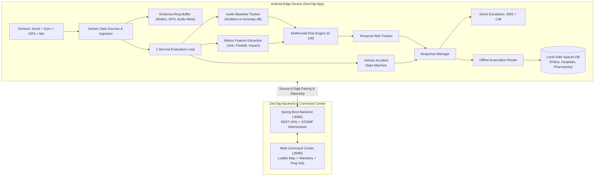

# ZeroTap 🛡️

**ZeroTap** is an autonomous, multimodal personal safety and incident intelligence platform. Built with an **offline-first edge architecture**, ZeroTap continuously monitors physical motion kinematics, acoustic environments, and geospatial context on-device. When danger or a vehicle accident is detected, it executes an autonomous escalation protocol while streaming real-time telemetry to a paired **Emergency Contact Web Command Center**.

---

## 🌟 Key Capabilities

### 1. 100% Offline-First Edge Risk Engine
* **Multimodal Kinematics & Motion**: Real-time 3-axis accelerometer and gyroscope analysis detecting abrupt freefall, violent deceleration drops (>24 m/s²), severe rotational jerk, and sustained post-impact stillness.
* **Vehicle Accident State Machine**: Autonomous 4-stage vehicle crash detection with a 15-second grace period, spoken prompts, and haptic warnings before automated emergency dispatch.
* **Adaptive Acoustic Baseline**: `AudioBaselineTracker` continuously models ambient decibel baselines (quiet, crowd, traffic, transit), detecting significant vocal/distress spikes while avoiding false positives from loud city environments.
* **Autonomous Fallback Navigation**: Direct mathematical evacuation course calculation (azimuth bearing, Haversine distance, and interpolated waypoints) to the nearest safe space (police station, hospital, 24/7 pharmacy) even with zero internet connectivity.

### 2. Emergency Contact & Web Command Center Link
* **Secure 1:1 Pairing**: Generates single-use, cryptographically secure 6-digit pairing codes that connect an Android device to an emergency contact's web dashboard.
* **Multi-Host Resilience**: Seamless auto-discovery across USB reverse tethering (`127.0.0.1:8080`), local Wi-Fi LAN, and standalone offline mode.
* **Live Telemetry & Status**: Streams GPS coordinates, risk level, battery health, and online/stale/offline indicators to the web dashboard.
* **Bidirectional "Are You OK?" Pings**: Emergency contacts can trigger a safety ping from the web dashboard. The phone sounds an urgent alert with an immediate `[I'M OK]` notification response that updates the command center in real time.

### 3. Vehicle Plate Vision & Evidence Capture
* **Integrated OCR Pipeline**: Roboflow bounding box plate localization + PaddleOCR character recognition + Indian license plate format validation (`AA 00 AA 0000`).
* **Evidence Management**: Captures location-stamped evidence items linked to incidents.

### 4. Dual Deployment Modes
* **Private Mode (Default)**: Complete local privacy. All risk scoring, audio classification, and safe space routing run strictly on-device with optional Bring-Your-Own-Key (BYOK) incident summaries.
* **Server Mode**: Connects to the ZeroTap Spring Boot backend for real-time remote monitoring, emergency contact pairing, and command center telemetry.

---

## 🏗️ Architecture Overview



---

## 📂 Repository Structure

```
ZeroTap/
├── app/                                # Android Application (Jetpack Compose, Kotlin)
│   ├── src/main/java/com/zerotap/
│   │   ├── ai/                         # Audio inference, BYOK, local heuristic models
│   │   ├── alert/                      # SMS, Call, and Internet alert transports
│   │   ├── core/config/                # Centralized AppConfiguration & deployment modes
│   │   ├── data/                       # Room database, repositories, API clients, DataStore
│   │   ├── domain/                     # Risk engine, accident state machine, models
│   │   ├── sensor/                     # Audio baseline tracker, motion & location sources
│   │   ├── service/                    # ProtectionForegroundService & safety ping loop
│   │   └── ui/                         # Compose screens (Home, Map, Contacts, Settings, Plate OCR)
│   └── src/main/assets/                # Pre-cached Safe Spaces dataset (Chennai & Tamil Nadu)
├── zerotap-server/                     # Spring Boot 3.3.4 Backend & Web Command Center
│   ├── src/main/java/com/zerotap/      # Controllers, pairing service, WebSocket publishers
│   └── src/main/resources/static/      # Web Command Center UI (HTML, CSS, Vanilla JS, Leaflet)
├── vehicle_plate_ai/                   # Python Vehicle Plate OCR Pipeline
│   ├── detector/                       # Roboflow plate detector
│   ├── ocr/                            # PaddleOCR character recognition
│   └── validation/                     # Indian license plate format validation
└── ARCHITECTURE.md                     # In-depth architectural design specification
```

---

## 🚀 Getting Started

### Prerequisites
* **Android**: Android Studio Jellyfish or newer, Android SDK 36 (min SDK 29), physical Android device or emulator.
* **Backend**: Java 21 JDK, Apache Maven 3.9+.

---

### Running the Web Command Center & Backend

1. Navigate to the `zerotap-server` directory:
   ```powershell
   cd zerotap-server
   ```
2. Build and run the server:
   ```powershell
   mvn clean spring-boot:run
   ```
3. Open your browser at **`http://localhost:8080`** to access the **Web Command Center**.

---

### Building and Running the Android App

1. Connect your Android device via USB with **USB Debugging** enabled.
2. In the repository root, build and install the debug APK:
   ```powershell
   .\gradlew.bat assembleDebug
   adb install -r app\build\outputs\apk\debug\app-debug.apk
   ```
3. To forward the local backend port to your physical phone over USB:
   ```powershell
   adb reverse tcp:8080 tcp:8080
   ```
4. Launch **ZeroTap** on your phone.

---

### Pairing Phone with Web Command Center

1. On the phone, navigate to **Settings** $\rightarrow$ **Emergency Contacts**.
2. Tap **"Generate Pairing Code"**.
3. A secure 6-digit code (e.g. `482   731`) will be displayed.
4. On the Web Command Center (`http://localhost:8080`), click **"Connect to ZeroTap User"**, enter the 6-digit code, and submit.
5. The dashboard will immediately link to your phone, showing live GPS telemetry, connection health, and enabling the **"Send Safety Ping"** feature.

---

### Running Unit Tests

To run the complete test suite across motion kinematics, audio baseline tracking, navigation, and pairing:
```powershell
.\gradlew.bat testDebugUnitTest
```
To run the Spring Boot integration tests:
```powershell
cd zerotap-server
mvn test
```

---

## 🔒 Security & Privacy

* **Local Sensor Isolation**: Raw microphone PCM audio is discarded immediately after acoustic feature extraction; raw audio is never written to disk or transmitted to any server.
* **Encrypted Snapshot Evidence**: The in-memory evidence ring buffer holds only the last 600 motion samples and 120 acoustic metadata points.
* **Cryptographic Pairing**: Pairing tokens are cryptographically random, expire in 10 minutes, and are single-use. Emergency contacts can only access telemetry from their explicitly paired device.
